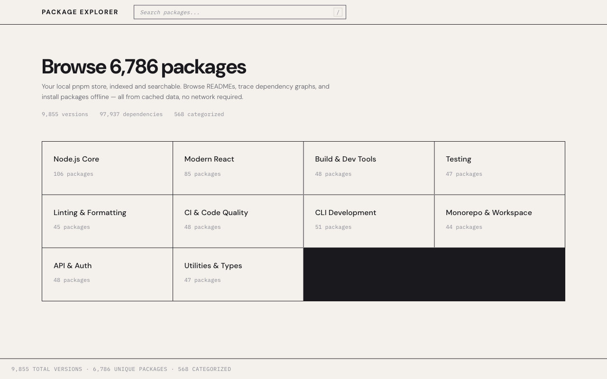
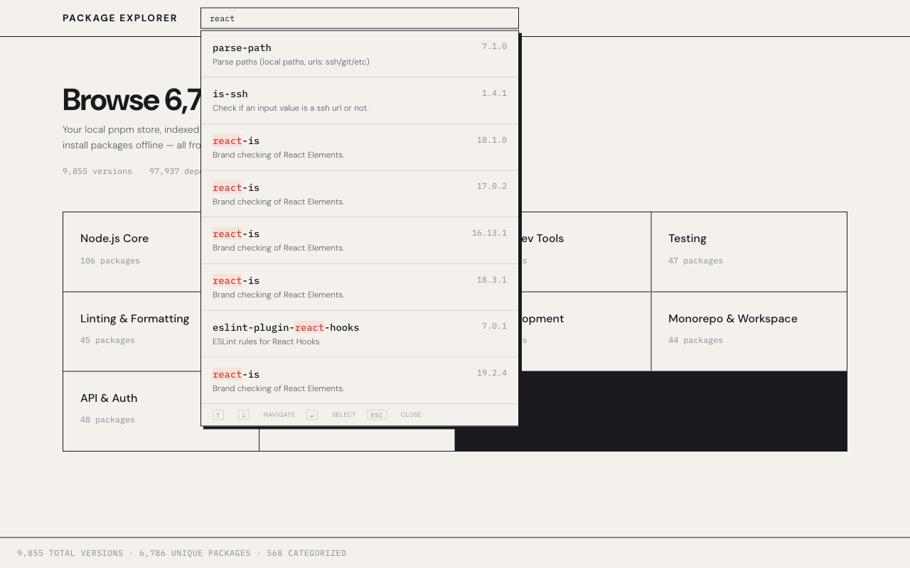
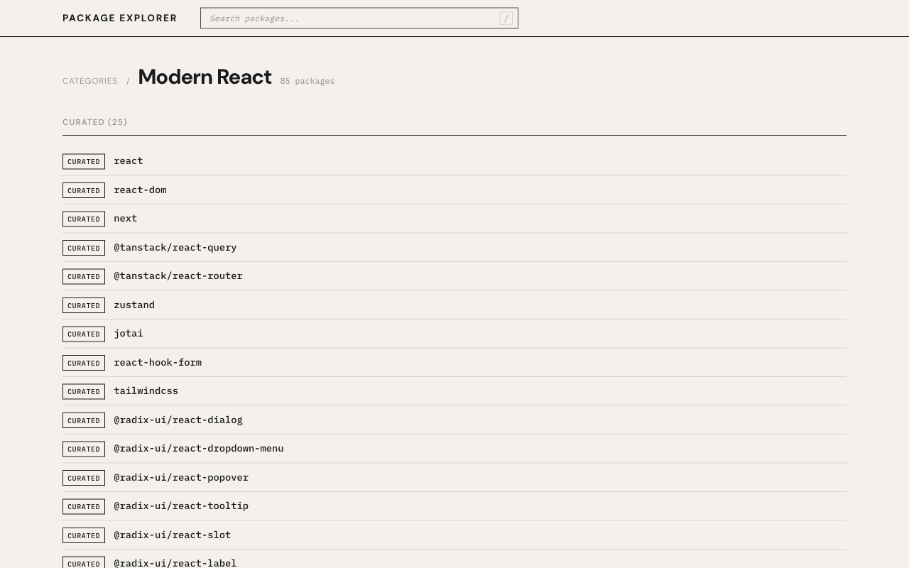
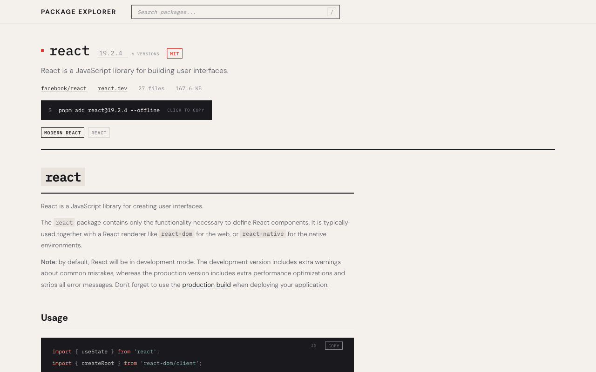

# Offline PNPM Browser

Browse and search your local pnpm store — entirely offline.

**Offline PNPM Browser** indexes npm packages cached in your local pnpm store into a searchable SQLite database with full-text search. Explore ~10,000 packages by category, read READMEs, inspect dependency graphs, and copy install commands — no network required.



## Features

- Full-text search with prefix matching and fuzzy fallback

  

- Category-based browsing (Node.js Core, Modern React, Build Tools, etc.)

  

- Package detail pages with rendered READMEs, syntax-highlighted code blocks

  

- Dependency and dependent graph navigation
- Version selector with copy-to-clipboard install commands
- Incremental indexing — re-index in ~1 second
- Works completely offline after initial indexing

## Prerequisites

- Node.js >= 22 (uses `node:sqlite`)
- pnpm

## Getting started

```bash
# Install dependencies
pnpm install

# Build the SQLite database from your local pnpm store
pnpm run index

# Start the dev server
pnpm run dev
```

The app runs at `http://localhost:3000`.

For production:

```bash
pnpm run build
pnpm run start
```

## Indexing

The indexer scans your local pnpm store (v10 content-addressable layout), reads each package's `package.json` and README from the content store via integrity hashes, and inserts everything into a SQLite database with FTS5 full-text search.

```bash
# First run — full index (~50-60s for ~10,000 packages)
pnpm run index

# Subsequent runs — incremental, only processes changed files (~1s)
pnpm run index

# Force a clean rebuild
pnpm run index:full
```

Incremental indexing compares file mtimes against a stored `last_indexed_at` timestamp. Only store index files modified since the last run are processed. The FTS index is rebuilt in bulk at the end (~1-2 seconds regardless of how many packages changed).

## Search

Search uses a three-tier strategy:

1. **FTS5 prefix search** — the primary path. Queries are tokenized and wrapped with `*` for prefix matching, so typing "fastif" matches "fastify". Ranked by FTS5 relevance.
2. **Fuzzy fallback (Fuse.js)** — when FTS5 returns zero results, falls back to fuzzy matching with typo tolerance. Handles transpositions ("fsatify"), missing characters ("fstify"), and other typos. The Fuse index is lazy-initialized on first use and kept in memory.
3. Searches across package names (weighted 3x), keywords (1.5x), and descriptions (1x).

## Scripts

| Command | Description |
|---|---|
| `pnpm run dev` | Start Vite dev server |
| `pnpm run build` | Build for production |
| `pnpm run start` | Build and start production server |
| `pnpm run index` | Index pnpm store into SQLite (incremental) |
| `pnpm run index:full` | Full rebuild of the index |
| `pnpm run pipeline` | Run discover → fetch → verify |
| `pnpm run backup` | Backup indexed data |
| `pnpm run restore` | Restore from backup |

## Tech stack

- [TanStack Start](https://tanstack.com/start) + React 19
- [Vite](https://vite.dev) 8
- SQLite with FTS5 via `node:sqlite`
- [Fuse.js](https://www.fusejs.io) (fuzzy search fallback)
- [sugar-high](https://github.com/huozhi/sugar-high) (syntax highlighting)
- [marked](https://marked.js.org) (markdown rendering)

## Contributing

Contributions are welcome. Please open an issue first to discuss what you'd like to change.

1. Fork the repository
2. Create your branch (`git checkout -b feature/my-change`)
3. Commit your changes
4. Push to the branch and open a pull request

This project uses [oxlint](https://oxc.rs) for linting and formatting, enforced via pre-commit hooks.

## License

[MIT](LICENSE)
